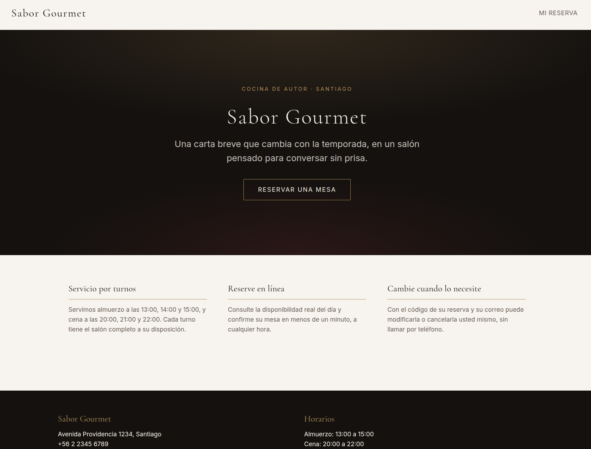
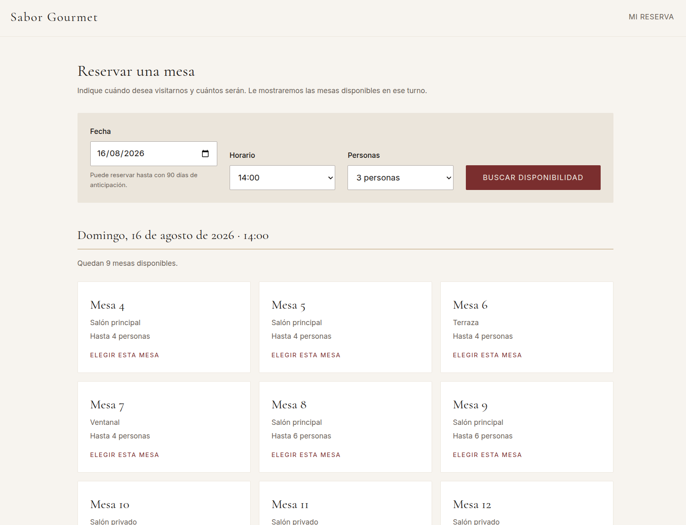
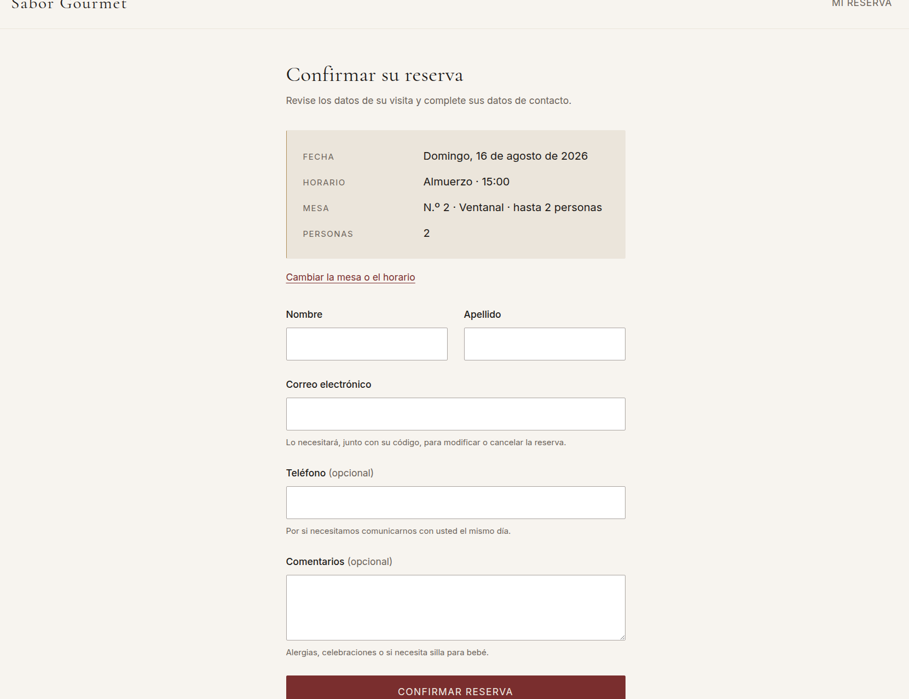
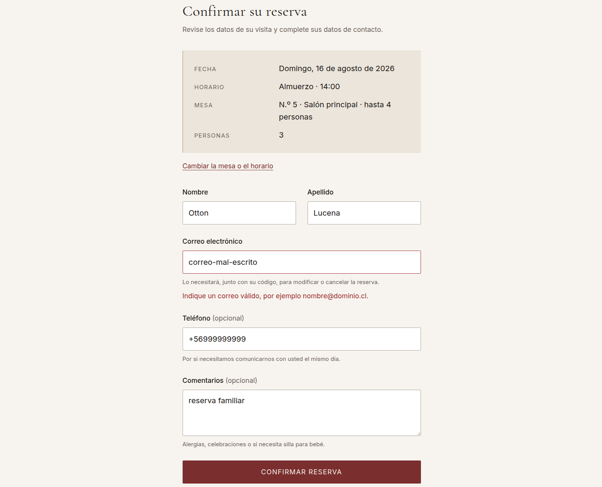
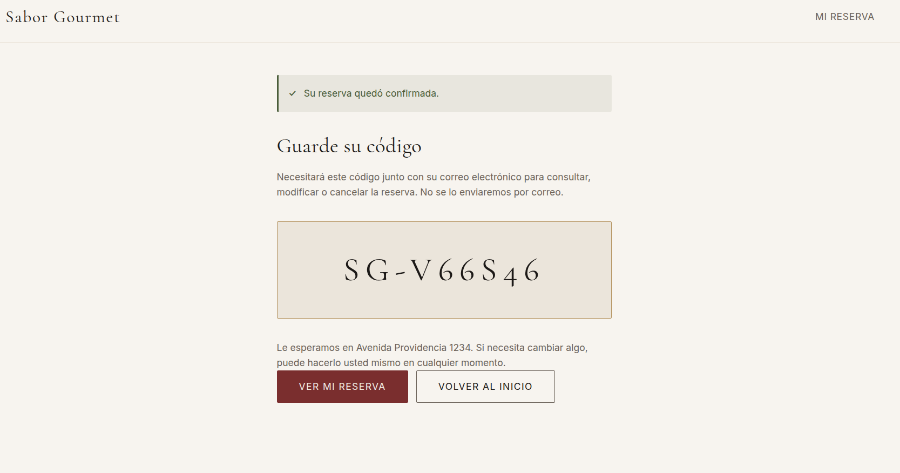
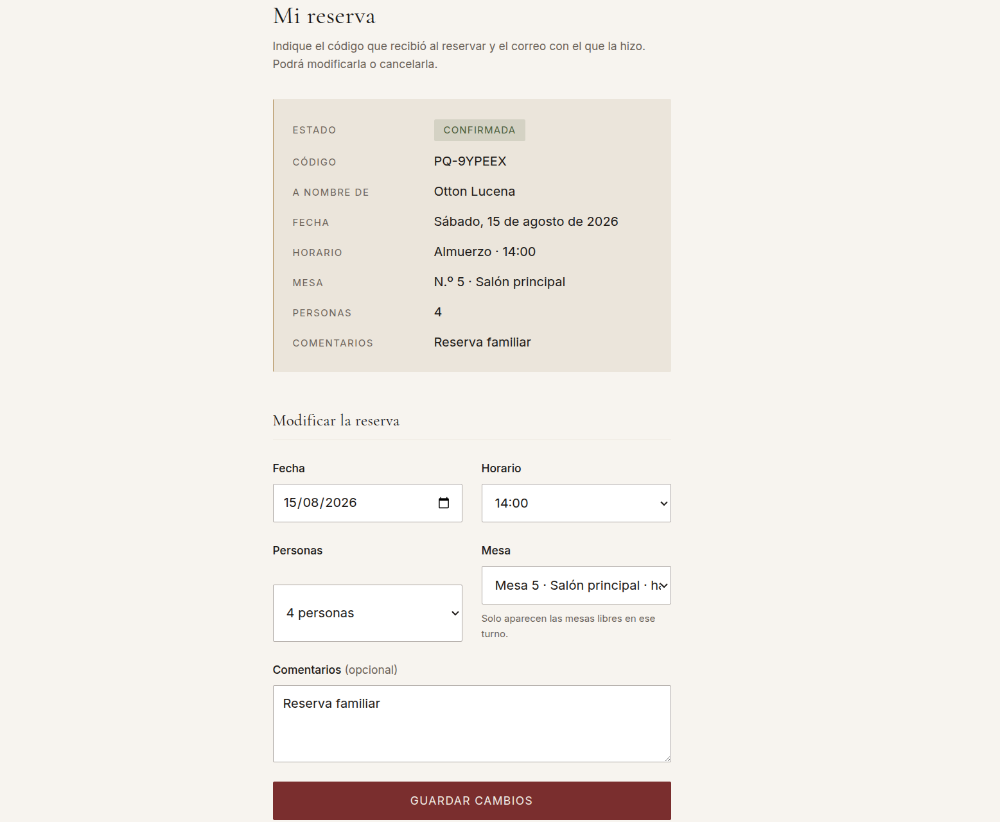
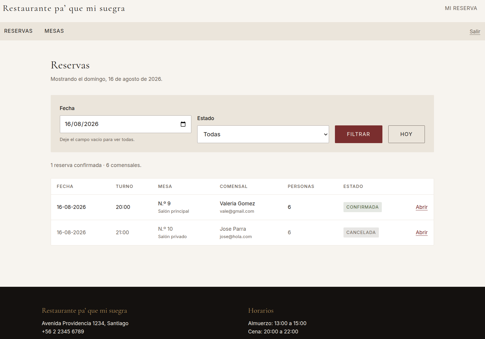
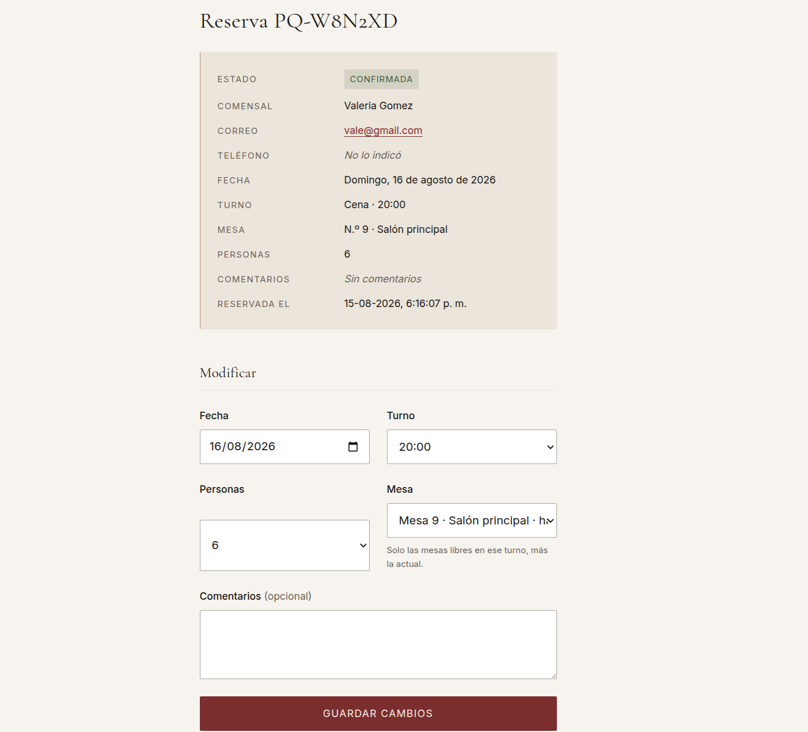
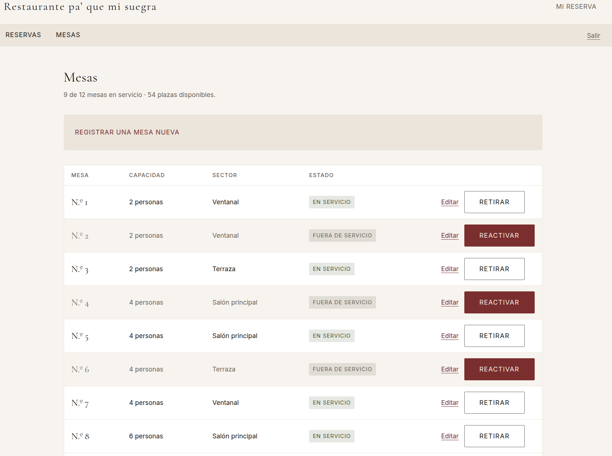
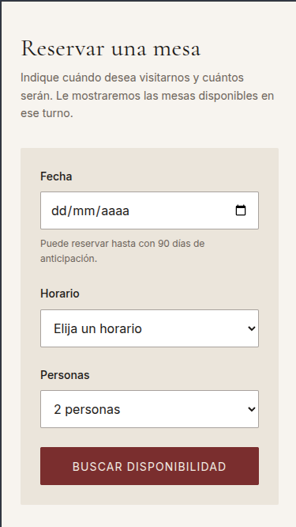

# Sabor Gourmet — Sistema de Reservas

Aplicación web que reemplaza la gestión manual de reservas de un restaurante de alta cocina.
Permite al comensal consultar disponibilidad y reservar una mesa en línea, y al personal
administrar las reservas y la configuración del salón.

## Estado del proyecto

| Parte | Estado |
|---|---|
| Análisis y diseño (`docs/`) | ✅ Completo |
| Modelo de datos y migraciones | ✅ Completo |
| Portal público: reservar, consultar, modificar y cancelar | ✅ Completo |
| Panel del personal: reservas y configuración del salón | ✅ Completo |

## Tecnologías

| Capa | Tecnología |
|---|---|
| Lenguaje | TypeScript |
| Framework | Next.js 16 (App Router) |
| ORM | Prisma 7 |
| Base de datos | PostgreSQL 17 |
| Validación | Zod 4 |

La justificación de cada elección, con las alternativas que se descartaron, está en
[`docs/stack.md`](./docs/stack.md).

## Cómo ejecutar el proyecto

**Requisitos:** Node.js 22 o superior, y Docker (solo para la base de datos).

```bash
# 1. Instalar dependencias
npm install

# 2. Configurar el entorno
cp .env.example .env

# 3. Levantar PostgreSQL
npm run db:up

# 4. Crear las tablas
npm run db:migrate

# 5. Cargar las mesas iniciales del restaurante
npm run db:seed

# 6. Iniciar la aplicación
npm run dev
```

La aplicación queda disponible en <http://localhost:3000>.

### Comandos disponibles

| Comando | Qué hace |
|---|---|
| `npm run dev` | Servidor de desarrollo. |
| `npm run build` | Compilación para producción. |
| `npm run start` | Ejecuta la compilación de producción. |
| `npm run typecheck` | Comprueba los tipos sin generar archivos. |
| `npm run lint` | Analiza el código. |
| `npm run db:up` / `db:down` | Levanta o detiene PostgreSQL. |
| `npm run db:migrate` | Crea y aplica migraciones. |
| `npm run db:seed` | Carga las mesas iniciales. |
| `npm run db:studio` | Explorador visual de los datos. |
| `npm run db:reset` | Borra la base y la reconstruye desde cero. |

## El software en funcionamiento

Recorrido por las pantallas del sistema y por lo que resuelve cada una.

### Portal del comensal

#### Portada



Una sola acción principal: reservar. Todo lo demás es secundario. Quien llega con hambre y el
teléfono en la mano debe alcanzar el formulario en un toque, así que no hay menús desplegables
ni carruseles que estorben.

#### Buscar disponibilidad



El comensal indica fecha, horario y cuántos serán, y el sistema responde con las mesas
realmente libres en ese turno. **Solo se muestran las que puede tomar**: una mesa ocupada no
aparece en gris, simplemente no está, porque leerla no le sirve de nada.

Las mesas se ordenan por capacidad ascendente, de modo que se ofrece primero la más ajustada
al grupo y no se malgasta una mesa de ocho personas en una pareja.

La búsqueda viaja en la dirección del navegador (`?fecha=…&turno=…&personas=…`), así que el
resultado se puede compartir, recargar y recorrer con el botón de volver mientras se comparan
horarios.

#### Confirmar la reserva



Antes de pedir datos personales, la pantalla repite qué se está reservando. Al cargar, el
servidor vuelve a comprobar que esa mesa siga disponible: alguien pudo llegar con un enlace
antiguo, o la mesa pudo ocuparse mientras la persona decidía.

#### Validación de los datos



Cada campo se valida en el servidor y el error se muestra **bajo el campo que lo provocó**,
diciendo qué hacer a continuación y no solo qué está mal.

Fíjese en que el resto de los datos siguen escritos. Un error en un campo no obliga a teclear
el formulario entero: el rechazo devuelve lo recibido y los campos vuelven a mostrarlo.

#### Código de reserva



El comensal no crea una cuenta. Recibe un código con el formato `SG-XXXXXX` que, junto con su
correo, le permite gestionar su reserva. Se muestra en grande y con las letras separadas
porque se copia a mano y se dicta por teléfono; por eso mismo el alfabeto excluye los
caracteres que se confunden al leerlos: no hay O ni 0, ni I, L o 1.

#### Consultar, modificar y cancelar



Con el código y el correo, el comensal ve su reserva y puede cambiarla o cancelarla él mismo.
El código se acepta aunque se transcriba mal —en minúsculas, con espacios o sin el guion—,
porque es lo que ocurre cuando se dicta por teléfono.

Al modificar, el desplegable de mesas incluye la que la reserva ya ocupa. Sin esa excepción,
quien solo quiere cambiar la cantidad de comensales vería su propia mesa marcada como ocupada
por sí misma.

### Panel del personal

#### Listado de reservas



Es la pantalla que reemplaza al cuaderno del mesón. Abre en el día de hoy, que es lo que el
personal necesita al llegar al turno, y encabeza con el recuento de reservas confirmadas y de
comensales esperados.

Las reservas canceladas se atenúan, pero su estado **además se dice con palabras**: el color
nunca es el único portador del significado, porque quien no distingue el verde del gris debe
poder usar el sistema igual.

#### Detalle de una reserva



Aquí el personal ve los datos de contacto del comensal —el correo y el teléfono son enlaces
directos, para llamar o escribir sin copiarlos— y puede modificar o cancelar la reserva.

Se aplican exactamente las mismas reglas que en el portal público, porque son las mismas
funciones: no existen dos copias que puedan desincronizarse.

#### Configuración del salón



El personal registra mesas, cambia su capacidad o su sector, y las retira o reactiva sin salir
del listado. El encabezado resume cuántas están en servicio y cuántas plazas ofrece el salón.

Dos reglas propias de esta pantalla:

- **El número de mesa es único**, porque es como el personal la nombra en el salón.
- **No se puede reducir la capacidad por debajo de las reservas ya confirmadas.** Una mesa
  rebajada a dos plazas con una reserva para seis dejaría al restaurante sin dónde sentar a
  ese grupo el día de la visita.

Retirar una mesa **no cancela** sus reservas futuras: el cierre puede ser temporal y quizá
convenga reubicar a esos comensales. Esa decisión es del personal, no del sistema.

### En el teléfono



La interfaz está diseñada partiendo del teléfono y creciendo hacia el escritorio, no al revés.
La página nunca se desplaza en horizontal: cuando una tabla es más ancha que la pantalla, se
desplaza dentro de su propio contenedor. Las zonas táctiles miden al menos 44 × 44 px y los
campos de formulario usan 16 px, porque por debajo de ese tamaño los navegadores móviles hacen
zoom automático al enfocar y descuadran la página.

## Cómo está organizado el código

El proyecto sigue el patrón **MVC** con cuatro capas de responsabilidad única. Cada capa solo
conoce a la siguiente.

```
Navegador
   │  petición HTTP
   ▼
Controlador  ── src/app/**/actions.ts      valida la entrada y delega
   │
   ▼
Servicio     ── src/services/**            aplica las reglas de negocio
   │
   ▼
Repositorio  ── src/repositories/**        lee y escribe con Prisma
   │
   ▼
PostgreSQL
```

La respuesta vuelve por el mismo camino y se renderiza en la **vista** (`src/app/**`), que
solo muestra datos: nunca consulta la base ni contiene reglas de negocio.

```
.
├── docs/                     Análisis, diseño y decisiones del proyecto
├── prisma/
│   ├── schema.prisma         Modelo de datos: fuente única de la verdad
│   ├── migrations/           Historial versionado del esquema
│   └── seed.ts               Mesas iniciales del restaurante
├── src/
│   ├── app/                  Rutas, vistas y controladores (Server Actions)
│   │   ├── reservar/         Buscar disponibilidad y confirmar la reserva
│   │   ├── reserva/          Confirmación con el código
│   │   ├── mi-reserva/       Consultar, modificar y cancelar
│   │   └── admin/            Panel del personal: reservas y mesas
│   ├── proxy.ts              Filtro previo a las rutas del panel
│   │   └── error.tsx         Pantalla de último recurso ante un fallo inesperado
│   ├── components/           Piezas de interfaz compartidas
│   ├── services/             Reglas de negocio
│   ├── repositories/         Acceso a datos
│   ├── validation/           Esquemas de validación con Zod
│   ├── lib/                  Utilidades e instancia de Prisma
│   └── generated/            Cliente de Prisma (se genera, no se versiona)
├── docker-compose.yml        PostgreSQL para desarrollo
└── prisma.config.ts          Configuración de la CLI de Prisma
```

## Modelo de datos

Tres entidades. El detalle de cada campo y de las reglas de negocio está en
[`docs/domain.md`](./docs/domain.md).

```
Customer  1 ──── *  Reservation  * ──── 1  Table
(cliente)             (reserva)             (mesa)
```

**Decisión central:** el servicio se modela como **turnos fijos** (13:00, 14:00, 15:00 para
almuerzo; 20:00, 21:00, 22:00 para cena) en lugar de horarios libres con duración estimada.
Así, la disponibilidad se resuelve con una comparación de igualdad en vez de un cálculo de
solapamiento de intervalos, y la regla *"una mesa no puede tener dos reservas confirmadas en
el mismo turno"* la garantiza un **índice único parcial** en PostgreSQL —no lógica de
aplicación que se pueda olvidar—, incluso si dos personas envían el formulario en el mismo
instante.

El comensal recibe un **código de reserva** (`SG-XXXXXX`) que, junto con su correo, le permite
consultar, modificar y cancelar sin necesidad de crear una cuenta.

## Panel del personal

Disponible en <http://localhost:3000/admin>, protegido con la clave definida en la variable
`ADMIN_ACCESS_KEY` del archivo `.env`.

> Si copió `.env.example` sin modificarlo, la clave es **`cambiar-esta-clave`**. Cámbiela por
> otra antes de usar el sistema fuera de su equipo.

| Pantalla | Qué permite |
|---|---|
| Reservas | Ver el listado del día, filtrar por fecha y estado, y abrir cada reserva. |
| Detalle de la reserva | Ver los datos de contacto del comensal, modificar la reserva o cancelarla. |
| Mesas | Registrar mesas, editarlas y ponerlas dentro o fuera de servicio. |

El acceso se comprueba en dos lugares. `proxy.ts` redirige cuanto antes a quien no traiga
sesión, para no cargar una pantalla que igualmente iba a rechazarse; y cada página y cada
acción vuelven a comprobarla, porque una acción se puede invocar sin pasar por la navegación.
La clave no se guarda en la galleta —solo su huella— y se compara en tiempo constante.

## Decisiones sobre los formularios

Tres reglas que gobiernan todos los formularios de la aplicación. Están explicadas a fondo en
[`docs/architecture.md`](./docs/architecture.md) §4 y §5.

**Un rechazo nunca borra lo escrito.** El marco de trabajo reinicia los campos en cuanto
termina la operación que los procesa, así que cada rechazo devuelve también lo recibido y ese
pasa a ser el valor inicial de los campos. Sin esto, equivocarse en una letra del correo
vaciaba el formulario entero.

**El navegador solo guarda lo imprescindible.** Un formulario con errores por campo necesita
recordar lo que la persona escribió; una operación que solo cambia algo y vuelve —retirar una
mesa, cancelar— no necesita recordar nada, y guardarlo crearía una copia que puede quedar
desfasada del dato real. En ese segundo caso la confirmación es que el dato cambie a la
vista.

**Las operaciones envían el estado deseado, no una orden de invertir el actual.** Fijar un
valor absoluto (`retirar esta mesa`) da el mismo resultado aunque la pantalla esté
desactualizada o se pulse dos veces; invertir el valor actual, no.

## Documentación

| Documento | Contenido |
|---|---|
| [`docs/brief.md`](./docs/brief.md) | El problema del restaurante y qué queda fuera del alcance. |
| [`docs/mvp.md`](./docs/mvp.md) | Alcance mínimo viable e historias de usuario. |
| [`docs/domain.md`](./docs/domain.md) | Entidades, atributos y reglas de negocio. |
| [`docs/stack.md`](./docs/stack.md) | Tecnologías elegidas y alternativas descartadas. |
| [`docs/architecture.md`](./docs/architecture.md) | Capas, MVC, SOLID y convenciones de código. |
| [`docs/design.md`](./docs/design.md) | Identidad visual y criterios de interfaz. |
